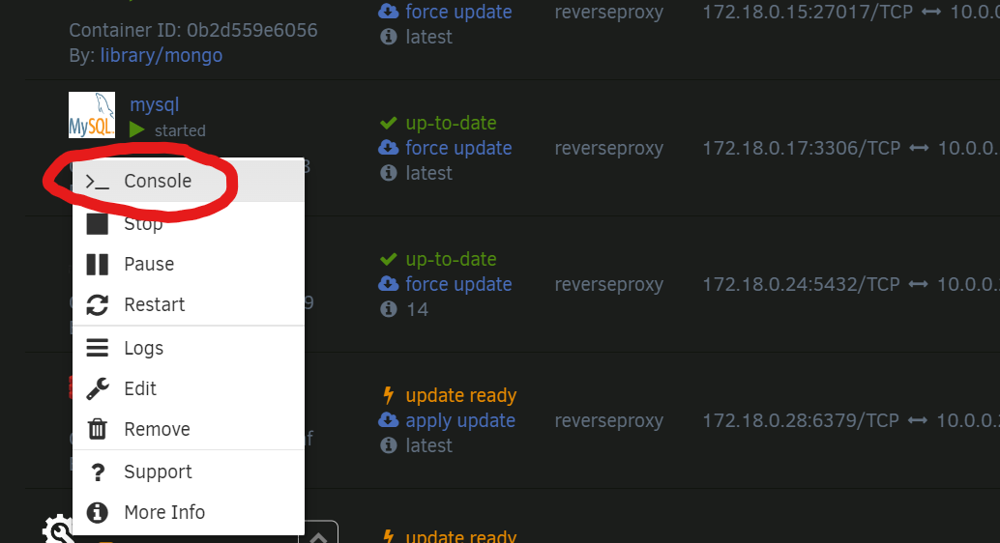
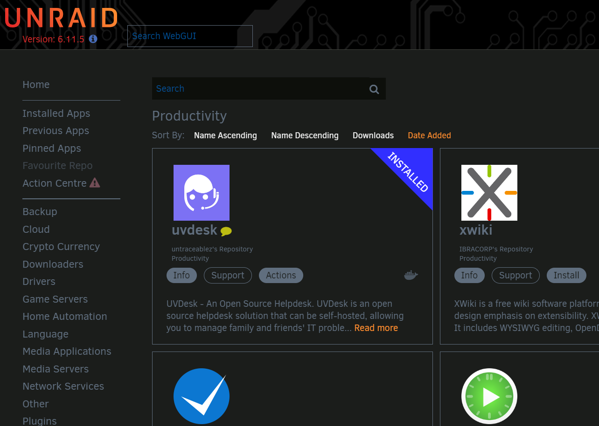

# uvdesk-unraid

## Table of Contents

 * [What is UVDesk?](#what-is-uvdesk)
 * [Self-Hosting](#self-hosting)
    * [Docker Run / Docker Compose](#docker-run--docker-compose)
    * [Non-Docker Setup](#non-docker-setup)
    * [unRAID](#unraid)
        * [unRAID Requirements](#unraid-requirements)
        * [Reverse Proxy](#reverse-proxy)
        * [Setting up the Database](#setting-up-the-database)
            * [Logging into mySQL](#logging-in)
            * [Creating the User](#creating-the-user)
            * [Creating the Database](#creating-the-database)
            * [Granting Privileges](#granting-user-privileges-on-database)
        * [Install uvdesk from Community Applications](#installing-uvdesk-from-community-applications)
    * [Accessing UVDesk &  First-Time Setup](#accessing-uvdesk--first-time-setup)
* [Acknowledgements](#acknowledgements)


## What is UVDesk?

[**UVDesk**](https://www.uvdesk.com/en/) is a open source helpdesk software solution. It has support for a multitude of features including the following: 

* A multi-customer & multi-agent ticket system.
* A full mailer system to send mail to agents and customers.
* A fully featured knowledge base for self-service.
* CMS Platform Support
* Plugin Support
* Custom branding

## Self-Hosting

### Docker Run / Docker Compose

This is a container template for hosting uvdesk on [unRAID](https://unraid.net/). If you are not using unRAID, there are better `docker-compose` and `docker-run` templates out there, such as the base for this unRAID image, [dietermartens/uvdesk](https://hub.docker.com/r/dietermartens/uvdesk/).

### Non-Docker Setup

If you're looking to install this on a non-containerized system, look to UVDesk's [Official Install Guide](https://github.com/uvdesk/community-skeleton#installation).


### unRAID

Alright, the main event and what this template is made for. If you're running unRAID you should be able to find this template underneath the **Productivity** or **Tools** sections in Community Applications, or by searching for `uvdesk`. 

#### unRAID Requirements

* You will need to have a **local** mySQL or MariaDB instance running on the same docker network as uvdesk. 
    * You will need to create a `uvdesk` database and `uvdesk` user with full privileges on that database *prior* to downloading uvdesk from Community Applications. Please refer to [Setting up the Database](#setting-up-the-database) for instructions.
* You will need a reverse proxy setup. 

#### Reverse-Proxy

Setting up a reverse proxy is a task all unto itself, and best left to better authors than I: 

* IBRACORP NGINX Proxy Manager Guide: <https://youtu.be/h1a4u72o-64>
* IBRACORP NGINX Proxy Manager **with Cloudflare** Guide: <https://www.youtube.com/watch?v=c6Y6M8CdcQ0>
* Spaceinvaderone's Reverse Proxy Guide (SWAG): <https://youtu.be/I0lhZc25Sro>

There are other guides, but these are all unRAID specific and should get you what you need to setup a reverse proxy. Note, the reverse proxy **must be setup prior to installing uvdesk**.


#### Setting up the Database

If you don't know how to setup a database in mySQL, it sounds scarier than it is. First, download a mariaDB or mySQL image from Community Applications. After you've done that, click on the container image and hit console: 



You should be presented with a terminal pop-up browser window. If not, make sure to allow popups from your server's domain name. 

##### Logging In

You'll first need to login to mysql as root, using the password you made when you generated the mySQL template, as so: 

```
mysql -u root -p
Enter password:
```
Once you paste/type in your password, you should see this: 

```
Welcome to the MySQL monitor.  Commands end with ; or \g.
Your MySQL connection id is 9
Server version: 8.0.32 MySQL Community Server - GPL

Copyright (c) 2000, 2023, Oracle and/or its affiliates.

Oracle is a registered trademark of Oracle Corporation and/or its
affiliates. Other names may be trademarks of their respective
owners.

Type 'help;' or '\h' for help. Type '\c' to clear the current input statement.

mysql>
```

##### Creating the User

Now we can create the user (uvdesk by default):   

`CREATE USER 'uvdesk'@'localhost' IDENTIFIED BY 'SUPERSECUREPASSWORDHERE';`

You should see this output:  
`Query OK, 0 rows affected (0.01 sec)`

##### Creating the Database

Now we create the database (uvdesk by default):
`CREATE DATABASE 'uvdesk'`;

Once again, you should see this output:
`Query OK, 1 rows affected (0.01 sec)`

##### Granting User Privileges on Database

Lastly, we need to give our `uvdesk` user all privileges on the uvdesk database: 

`GRANT ALL PRIVILEGES ON uvdesk.* TO 'uvdesk'@'localhost' IDENTIFIED BY 'SUPERSECUREPASSWORDHERE';`

Once last time, you should see this output:  

`Query OK, 1 rows affected (0.01 sec)`

You've now done all the work you'll need to do in mySQL, you can exit the pop-up window or leave by typing `exit`. 

#### Installing uvdesk from Community Applications

To install uvdesk from Community Applications, simply navigate to Community Apps and head to either **Productivity** or **Tools**, or just search `uvdesk`, you should see it in the results like this: 



#### Accessing UVDesk &  First-Time Setup

##### Configuring the Container
When you get to the container configuration page in unRAID, make sure to fill in all of your details regarding your mySQL instance, as well as your intended domain name for your instance (eg. help.mydomain.com). You will also need to generate an app secret, any 32 character randomized string will do. Lastly, make sure to set the timezone and currency to your local ones. 

##### Accessing the webUI
After that, just hit apply and when you navigate to your domain name or http://SERVERIP:6744 you'll be presented with the Setup Wizard. You'll need to type the same mySQL info, and then create an admin user. After that, start exploring! 


## Acknowledgements

Thanks to @MountainGod on the IBRACORP Discord for some help with the environment flags. 
Thanks just to the overall unRAID community, it's a blast to finally contribute something back!
